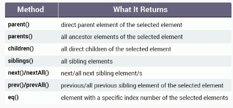
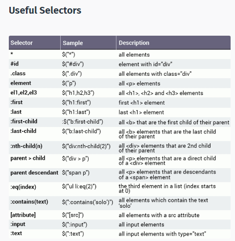
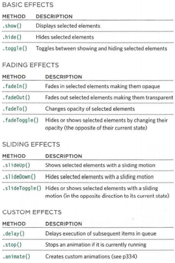

# jQuery, Events, and The DOM

---

**What is jQuery?**

*jQuery is a lightweight, "write less, do more", JavaScript library.*

*The purpose of jQuery is to make it much easier to use JavaScript on your website.*

*jQuery takes a lot of common tasks that require many lines of JavaScript code to accomplish, and wraps them into methods that you can call with a single line of code.*

*The jQuery library contains the following features:*

- HTML/DOM manipulation
- CSS manipulation
- HTML event methods
- Effects and animations
- AJAX
- Utilities

**Why jQuery?**

*There are lots of other JavaScript libraries out there, but jQuery is probably the most popular, and also the most extendable.*

**Adding jQuery to Your Web Pages**

*There are several ways to start using jQuery on your web site. You can:*

` Download the jQuery library from jQuery.com`

` Include jQuery from a CDN, like Google`

**DOM jQuery**

---

**jQuery Selectors**

---

**Effects**

---

# The End 