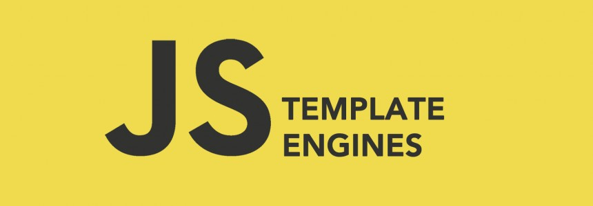
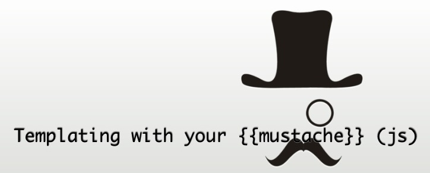

# Flexbox and Templating

**Js Templating**

*Javascript templating is a fast and efficient technique to render client-side view templates with Javascript by using a JSON data source.*

*The template engine then replaces variables and instances declared in a template file with actual values at runtime, and convert the template into an HTML file sent to the client.*

---

**Mustache**

*Mustache is a logic-less template syntax. It can be used for HTML, config files, source code — anything. It works by expanding tags in a template using values provided in a hash or object.*

--- 
# Flexbox

**CSS Flexbox Layout Module**

The flex item properties are:

- order
- flex-grow
- flex-shrink
- flex-basis
- flex
- align-self

---

**align content**

 - `normal (default)`: items are packed in their default position as if no value was set.

- `flex-start / start`: items packed to the start of the container. The (more supported) flex-start honors the flex-direction while start honors the writing-mode direction.

- `flex-end / end`: items packed to the end of the container. The (more support) flex-end honors the flex-direction while end honors the writing-mode direction.

- `center`: items centered in the container
space-between: items evenly distributed; the first line is at the start of the container while the last one is at the end

- `space-around`: items evenly distributed with equal space around each line

- `space-evenly`: items are evenly distributed with equal space around them

- `stretch`: lines stretch to take up the remaining space

---

# The End 