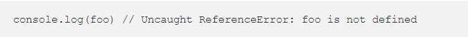
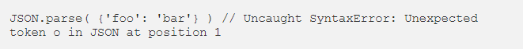
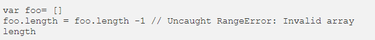
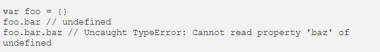

#  THE CALL STACK

---

**What is a Call Stack**

*A `call stack` is a mechanism for an interpreter to keep track of its place in a script that calls multiple functions — what function is currently being run and what functions are called from within that function.*

*In general we start with an `empty Call Stack`. Whenever we invoke a function, it is automatically `added to the Call Stack`. Once the function has executed all of its code, it is automatically `removed from the Call Stack`. Ultimately, the Stack is `empty again`.*

*At the most basic level, a call stack is a data structure that uses the Last In, First Out (LIFO) principle to temporarily store and manage function invocation (call).*

**LIFO** 

*`Last In, First Out`, it means that the last function that gets pushed into the stack is the first to be pop out, when the function returns.*

**The key takeaways from the call stack are:**

- It is single-threaded. Meaning it can only do one thing at a time.

- Code execution is synchronous.

- A function invocation creates a stack frame that occupies a temporary memory.

- It works as a LIFO — Last In, First Out data structure.

---
## JS Debugging

*No one is above or immune to making mistakes and in coding just like life you will make mistakes that YOU need to fix, this chapter will talk about debugging in js as the name suggests.*

*To find the source of an error, it helps to know how scripts are processed. The order in which statements are executed can be complex; some tasks cannot complete until another statement or function has been run,the order is not always as the layout suggests .*

*To debug your JS code, the easiest and maybe the most common way its to simply console.log() the variables you want to check*

---

## Types of error messages

- Reference errors

` Example `

---

- Syntax errors

` Example `

---

- Range errors

` Example `

---

- Type errors

` Example `

---

## Conclusion

*Being able to read error messages and practising debugging is one of your biggest weapons has a developer, do it frequently and with enough time you will notice a great decrease in the time you spend on each error that you find along the way.*

---

# THE END

