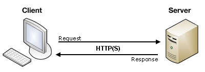

# SENDING FORM DATA

---

**SENDING FORM DATA**

*Form attributes:*

- `action = "url` : the data will be sent to the specified url / if none to the same page.

- `method = "GET"` : the data will be sent as a request in the header. (url/?key=value&key2=value2).

- `method = "POST"` : the data will be sent as a request in the body. (more secure, better for longer data, and sending files).

---

# Forms

**Form tag attributes:**

- `action = "/path-to-url"`

- `method = "GET/POST"`

- `name = "formName"`

- `autocomplete = "on/off"`

- `target = "_blank" (new tab) / "_self" (current tab)`

- `enctype = "text/plain" (text input form) "multipart/form-data" (forms containing files)`

---

# Summary

*As we'd alluded to above, sending form data is easy, but securing an application can be tricky. Just remember that a front-end developer is not the one who should define the security model of the data . It's possible to perform client-side form validation, but the server can't trust this validation because it has no way to truly know what has really happened on the client-side.*

*If you've worked your way through these tutorials in order, you now know how to markup and style a form, do client-side validation, and have some idea about submitting a form.*

---

# THE END