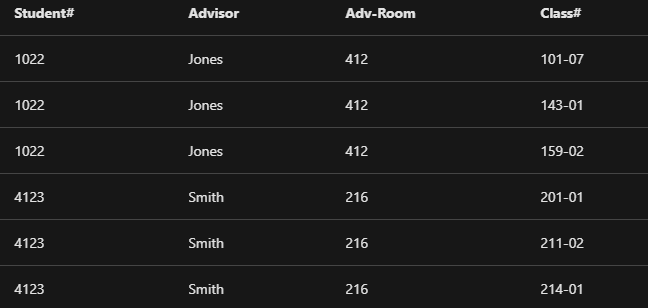

# DATABASE NORMALIZATION

---

## Description of normalization

*Normalization is the process of organizing data in a database. This includes creating tables and establishing relationships between those tables according to rules designed both to protect the data and to make the database more flexible by eliminating redundancy and inconsistent dependency.*

---

## Reasons for Database Normalization

*There are three main reasons to normalize a database.  `The first is to minimize duplicate data`, `the second is to minimize or avoid data modification issues`, and `the third is to simplify queries`. *

---

## Normalizing an example table

These steps demonstrate the process of normalizing a fictitious student table.

1- **Unnormalized table:**

2- **`First normal form:` No repeating groups**

*Tables should have only two dimensions. Since one student has several classes, these classes should be listed in a separate table. Fields Class1, Class2, and Class3 in the above records are indications of design trouble.*

*Spreadsheets often use the third dimension, but tables should not. Another way to look at this problem is with a one-to-many relationship, do not put the one side and the many side in the same table. Instead, create another table in first normal form by eliminating the repeating group (Class#), as shown below:*

3- **`Second normal form: `Eliminate redundant data**

*Note the multiple Class# values for each Student# value in the above table. Class# is not functionally dependent on Student# (primary key), so this relationship is not in second normal form.*

*The following two tables demonstrate second normal form:*

Students:

Registration:

4- **`Third normal form:` Eliminate data not dependent on key**

*In the last example, Adv-Room (the advisor's office number) is functionally dependent on the Advisor attribute. The solution is to move that attribute from the Students table to the Faculty table, as shown below:*

Students:

Faculty:

# THE END